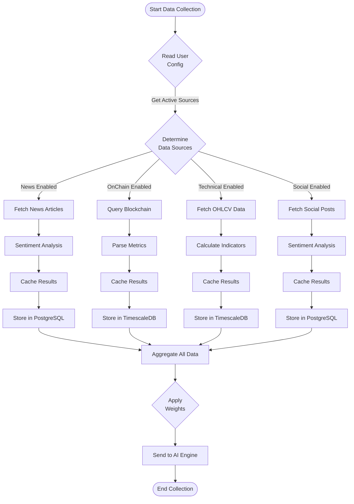

# NexYpher Data Flow Diagram

## High-Level Data Flow


## Detailed Recommendation Generation Flow


## Data Collection Flow Details



## Performance Tracking Flow


## Cache Strategy Flow


## Configuration Application Flow


## System Architecture Layers

```
┌─────────────────────────────────────────────────────────────┐
│                     PRESENTATION LAYER                       │
│  Web UI, Mobile Apps, API Clients, WebSocket Connections   │
└────────────────────────┬────────────────────────────────────┘
                         │
┌────────────────────────┴────────────────────────────────────┐
│                      API GATEWAY LAYER                       │
│   Authentication, Rate Limiting, Request Routing, CORS      │
└────────────────────────┬────────────────────────────────────┘
                         │
┌────────────────────────┴────────────────────────────────────┐
│                     APPLICATION LAYER                        │
│  FastAPI Endpoints, Request Validation, Response Formatting │
└────────────────────────┬────────────────────────────────────┘
                         │
┌────────────────────────┴────────────────────────────────────┐
│                     ORCHESTRATION LAYER                      │
│   Workflow Coordination, Task Scheduling, Cache Management  │
└────────────────────────┬────────────────────────────────────┘
                         │
┌────────────────────────┴────────────────────────────────────┐
│                   DATA COLLECTION LAYER                      │
│    News, OnChain, Technical, Social Data Collectors         │
└────────────────────────┬────────────────────────────────────┘
                         │
┌────────────────────────┴────────────────────────────────────┐
│                      AI ANALYSIS LAYER                       │
│   Data Aggregation, GPT-4o Processing, Recommendation Gen   │
└────────────────────────┬────────────────────────────────────┘
                         │
┌────────────────────────┴────────────────────────────────────┐
│                    PERSISTENCE LAYER                         │
│   PostgreSQL (Relational), TimescaleDB (Time-Series),       │
│   Redis (Cache & Queue)                                      │
└─────────────────────────────────────────────────────────────┘
```
